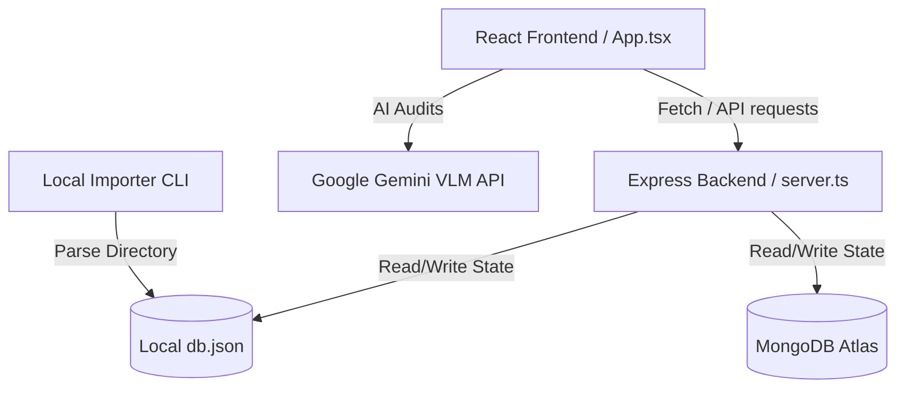

# 🚀 Vision-Language Street Audit Platform (VLSAP)

[](https://react.dev/)
[](https://www.typescriptlang.org/)
[](https://vite.dev/)
[](https://tailwindcss.com/)
[](https://expressjs.com/)
[](https://ai.google.dev/)

**VLSAP (Vision-Language Street Audit Platform)** is a state-of-the-art, full-stack application designed for conducting collaborative and AI-assisted audits of street view imagery. Built to bridge the gap between human audits and multimodal models, VLSAP offers interactive calibration, reliability analytics, and automated AI scoring of panoramic street environments.

---

## 🗺️ System Architecture

VLSAP is structured as a full-stack, single-repository applet:



- **Frontend**: A highly dynamic React single-page application styled using modern Glassmorphism, Tailwind CSS v4, dynamic micro-animations (Framer Motion), and Recharts for analytics dashboards.
- **Backend**: Express server running on Node.js using `tsx` in development and bundled using `esbuild` for production. It handles serving build assets, API proxying, and cross-session state replication.
- **Database Layer**: Dual-mode storage adapter. Automatically falls back to a local JSON file (`db.json`) if MongoDB Atlas credentials are not provided or connection fails, facilitating frictionless local development.
- **AI Core**: Native integration with the official Google GenAI SDK (`@google/genai`) to send street view panoramas to Gemini Vision models with structured system instructions.

---

## ✨ Key Features

### 👤 1. Auditor Portal
- **Demographic Profiles**: Securely captures auditor qualifications, target parameters, and locations.
- **Audit Interface**: A streamlined, step-by-step scoring dashboard for street view imagery.
- **Dynamic Judgment Variables**: Validates inputs against standardized street design criteria (Domain 2 & 3 judgment variables) defined in `src/data/variables.json`.
- **Directional Panoramas**: View multi-angle perspectives (North, East, South, West) for holistic street assessment.

### 🤖 2. AI Audit Panel
- **Zero-Shot Evaluation**: Leverages Gemini Vision models to audit the active image using the identical assessment rubrics.
- **Real-Time Explanation**: Gemini does not just score; it provides detailed textual justification for each assessment it makes.
- **Confidence Levels**: The VLM estimates confidence levels for each rating to help identify edge cases.

### 📊 3. Comparison & IRR Dashboard
- **Inter-Rater Reliability (IRR)**: Computes real-time agreement metrics (Percentage Agreement, Fleiss' Kappa, or Cohen's Kappa) across active raters.
- **Variable-by-Variable Analytics**: Compares consensus distributions and visualizes human vs. AI score deviations using interactive Recharts bar and line graphs.
- **Consensus Explorer**: Drills down into specific audit variables to reconcile divergent human ratings.

### ⚙️ 4. Admin Panel
- **Calibration Phase Control**: Swap phases dynamically between **Cold Read**, **Warm Read**, and **Reconciliation**.
- **Auditor Management**: Add custom raters, review assigned street views, and enable automated image auto-assignments.
- **Instrument Lock**: Lock the rating form globally once a calibration exercise commences to prevent retro-active changes.
- **MongoDB Atlas Integration**: Connect to a cloud cluster with one click to store and sync states globally.

---

## 🛠️ Installation & Local Setup

### Prerequisites
- **Node.js**: `v18.x` or later
- **NPM**: `v9.x` or later
- **Gemini API Key**: Obtainable from [Google AI Studio](https://aistudio.google.com/) (Optional, needed for AI features).

### 1. Clone & Install Dependencies
```bash
git clone https://github.com/anshulsinghrs/Auditor-Portal_VLSAP.git
cd vision-language-street-audit-platform-vlsap
npm install
```

### 2. Configure Environment Variables
Create a `.env` file in the root directory:
```env
# Gemini API Key (Required for AI Audit features)
GEMINI_API_KEY="your-gemini-api-key-here"

# MongoDB Connection URI (Optional: falls back to local db.json if empty)
MONGODB_URI="mongodb+srv://<username>:<password>@cluster.mongodb.net/vlsap"

# Custom path for local JSON database file (Defaults to db.json in root)
DB_PATH="./db.json"
```

### 3. Run the Development Server
Starts the Express server which hosts the API and configures a Vite development middleware proxy:
```bash
npm run dev
```
Open your browser and navigate to `http://localhost:3000`.

---

## 🗃️ Data Management & Image Seeding

### Seeding Local Image Datasets
VLSAP has a dedicated image import script that scans your local file system and seeds `db.json` with ready-to-audit street imagery.

1. Create the target directory (if it does not exist) and copy your street images (`.jpg`, `.jpeg`, `.png`, `.webp`) into:
   `public/images/`
2. Execute the importer CLI script:
   ```bash
   node scripts/import_local_images.cjs
   ```
3. The database state will be compiled automatically and immediately loaded into your auditor feeds.

---

## 🚀 Production Deployment on Render

This project is optimized for direct hosting on **Render.com**.

1. Create a new **Web Service** linked to your GitHub repository.
2. Select the following settings:
   - **Runtime**: `Node`
   - **Build Command**: `npm install && npm run build`
   - **Start Command**: `npm start`
   - **Instance Type**: `Free` or higher
3. Add the required Environment Variables in the **Environment** tab:
   - `NODE_ENV` = `production`
   - `GEMINI_API_KEY` = `your-api-key`
   - `DB_PATH` = `/data/db.json`
4. Configure a **Persistent Disk** (Highly Recommended if not using MongoDB):
   - **Name**: `vlsap-disk`
   - **Mount Path**: `/data`
   - **Size**: `1 GiB`
